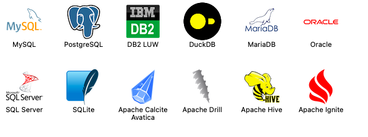
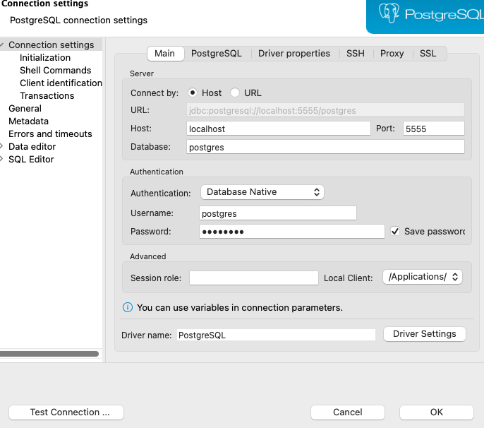

This project creates a dockerised data pipeline that stores data from a csv file to postgreSQL running in a docker container. We’ll further use DBeaver to interactively query our data. 

# 0. Setup

To make this work you will have to install the following programmes: 

- [Docker](https://www.docker.com/)
- [Dbeaver](https://dbeaver.io/download/)
    - DBeaver is an awesome database management system. You can download it as a desktop application, open source and free to download.
    - DBeaver can connect to several types of databases, here the most popular ones:
    
    
    
    - It allows you to execute SQL queries, browse and investigate your data and database structure in an easy to-use editor, and much more.
    
- Python libraries:
    - SQLAlchemy
    - psycopg2
    - pandas

*We won’t need to install a local instance of PostgreSQL since we’ll be installing it *only* within Docker (= pulling the PostgreSQL Docker image to our local machine, and then running it within a container). This is another great advantage of Docker - you won’t need to install local version of each software you use. 

# 1. Read and store data to PostgreSQL with python

1. Use SQLAlchemy to:
- connect our python script to a postgreSQL server
- create a database Schema (i.e define what out table looks like: column names, data types and other specifications)
- read data from a pandas dataframe into the table

# 2. Write a Dockerfile for your script


Our very simple Dockerfile will look like this: 

```docker
# python 3.9 is our base image that we're building on
FROM python:3.9

# Set the working directory in the container to /app
WORKDIR /app

# Copy the requirements file into the container at /app
COPY requirements.txt /app

# Install any needed packages specified in requirements.txt
RUN pip install -r requirements.txt

# Run the main.py file after container initiated
CMD ["python", "main.py"]
```

*Make sure you name the file exactly as Dockerfile (capital D, no extension) and place it in the same folder as your [main.py](http://main.py) file. 

# 3. Write a yaml file

Our simple ‘barebones’ yaml file: 

```yaml
version: "3.9"

# Services
services:
  etl:
    image: "python:3.9"
    build: etl/
    volumes:
      - './etl/:/app'
    depends_on:
      - database

  database:
    image: "postgres:12-alpine"
    environment:
      - POSTGRES_DB=postgres
      - POSTGRES_USER=postgres
      - POSTGRES_PASSWORD=password
    ports:
      - "5555:5432"
```

# 4. Check your folder structure

Docker and docker-compose are very sensitive to the correct folder structure. 

# 5. Use docker-compose to run the entire thing with only two commands

Now that we have our yaml file, our Dockerfile and folder structure in order, we can run the entire thing from start to finish with just two commands. First make sure you have navigated to the folder where your yaml file is located and then run: 

`docker-compose build`

`docker-compose run`

Docker-compose replaces running multiple docker commands and allows us to connect containers to each other and define an order in which they should run. 

# 6. Make connection to database in DBeaver

With your desktop DBeaver open, you can make a connection by clicking the tiny plug in the upper-left corner. Or navigating in the toolbar to Database —> New Database Connection



Next we will specify our connection settings:


Make sure that you change the Port to 5555, as specified in the yaml file, and use the same username and password as in your python script.  Finally, test that the connection works with the ‘Test Connection’. 

Voila! Now you can easily browse, query and modify your data! 

Alternatively, you can also take a look at your data through a psql terminal. 

To do this, run your docker-compose on the background of your terminal with `docker-compose up -d` (this means the docker-compose will be up and running but your terminal won’t be taken over by it).

Once it’s running, type in `docker exec -it [Container ID] psql -U postgres` and now you’re within the psql shell and can run psql commands on the data that you just stored. 

*You can find out the ID of the running postgres container with `docker ps` This lists all the running containers. 

# Z. Some potential points of failure

- Make sure your username and password for postgreSQL are exactly the same when creating the connection engine in your [main.py](http://main.py) file and in the yaml file.
- Change the psycopg2 in your requirements.txt file to psycopg2-binary. Why? Mysterious to me, but it worked.
- The name of the folder where your python script and Dockerfile are located has to correspond exactly to the name given to it in the yaml file (in our example both are ‘etl’)
- Dockerfile named Dockerfile, not dockerfile or any other variation. No file extension
- Dockerfile located within the etl folder
- Make sure the **port mapping (hostPort:containerPort)** in our connection engine corresponds to the name we gave to our container running postgres in the yaml file (See point 3)


```python

def make_connection():
    '''
    Make a connection to the database
    '''
    engine = sqlalchemy.create_engine(
        "postgresql+psycopg2://postgres:password@**database:5432**/postgres")
    return engine
```

- If you are running the script locally (this requires a local installation of postgreSQL), the port mapping has to be [localhost:5432](http://localhost:5432).


## To do: 
- host data in AWS 
